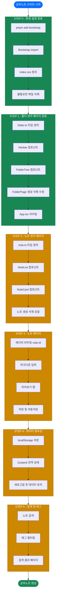

# 공부노트 사이트 작업 순서도

```mermaid
flowchart TD
    START([공부노트 사이트 시작]) --> STEP0

    subgraph STEP0[STEP 0 - 환경 설정 완료]
        direction TB
        S0A[pnpm add bootstrap] --> S0B[Bootstrap import]
        S0B --> S0C[index.css 정리]
        S0C --> S0D[불필요한 파일 삭제]
    end

    STEP0 --> STEP1

    subgraph STEP1[STEP 1 - 폴더 관리 페이지 완료]
        direction TB
        S1A[folder.ts 타입 정의] --> S1B[Navbar 컴포넌트]
        S1B --> S1C[FolderTree 컴포넌트]
        S1C --> S1D[FolderPage 생성 삭제 수정]
        S1D --> S1E[App.tsx 라우팅]
    end

    STEP1 --> STEP2

    subgraph STEP2[STEP 2 - 노트 관리 페이지]
        direction TB
        S2A[note.ts 타입 정의] --> S2B[NoteList 컴포넌트]
        S2B --> S2C[NoteCard 컴포넌트]
        S2C --> S2D[노트 생성 삭제 모달]
    end

    STEP2 --> STEP3

    subgraph STEP3[STEP 3 - 노트 에디터]
        direction TB
        S3A[에디터 라우팅 note-id] --> S3B[마크다운 입력]
        S3B --> S3C[미리보기 탭]
        S3C --> S3D[저장 및 자동저장]
    end

    STEP3 --> STEP4

    subgraph STEP4[STEP 4 - 데이터 영속성]
        direction TB
        S4A[localStorage 저장] --> S4B[Zustand 전역 상태]
        S4B --> S4C[새로고침 후 데이터 유지]
    end

    STEP4 --> STEP5

    subgraph STEP5[STEP 5 - 검색 및 태그]
        direction TB
        S5A[노트 검색] --> S5B[태그 필터링]
        S5B --> S5C[검색 결과 페이지]
    end

    STEP5 --> END([공부노트 완성])

    style START fill:#0d6efd,color:#fff,stroke:none
    style END   fill:#198754,color:#fff,stroke:none
    style STEP0 fill:#198754,color:#fff,stroke:#146c43
    style STEP1 fill:#198754,color:#fff,stroke:#146c43
    style STEP2 fill:#cc8800,color:#fff,stroke:#a06a00
    style STEP3 fill:#cc8800,color:#fff,stroke:#a06a00
    style STEP4 fill:#cc8800,color:#fff,stroke:#a06a00
    style STEP5 fill:#cc8800,color:#fff,stroke:#a06a00
```
